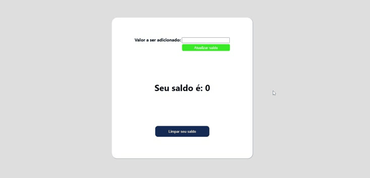

 

    <a href="">☆ Português Brasileiro</a>
    <a href="">☆ English ☆</a> 

<h1 align="center">
    <a href="https://fernanda1701.github.io/desafios-de-codigo-typescript/">Desafios de código Typescript</a>
</h1>

Code challenges from Santander Bootcamp's <b><i>Practical Introduction to TypeScript</b></i> course

<h2 align="center">

</h2>

## 💎 About

The project is designed for fixing basic knowledge in <b>TypeScript</b>.

<h3>Challenge 1 and 2</h3>

The proposal of challenge 1 and challenge 2, is to transcribe a <b><i>JavaScript</b></i> code to <b><i>TypeScript</b></i> to improve it and run it without errors.
- In <b>challenge 1</b>, we have the employee's register, where we can see the "<b>code</b>" and/or the "<b>name</b>" of an employee.
- In <b>challenge 2</b>, we have the creation of an <b><i>enum</b></i> and a <b><i>type</b></i> to serve as a model and type for the people's register, containing:
  - [x] Name
  - [x] Age
  - [x] Profession
  
Their functionalities will be available for consultation in a console.

<h3>Challenge 3</h3>

The third challenge proposes the improvement of a code that has errors in <b><i>JavaScript</b></i>, transcribing it to <b><i>TypeScript</b></i> and making the functionality applicable. 
In this case, an application was developed to make an account balance query, where you can <b><i>add</b></i> or <b><i>clear</b></i> values in <b><i>your account</b></i> balance. 
Below is a demonstration of the functionality:

<h3 align="center">Challenge 3</h3>

  

To check out the webpage of <b>Challenge 3</b> ➞ <a href="https://fernanda1701.github.io/desafios-de-codigo-typescript/">Click here!</a>

## 🛠 Technologies
 
- [HTML5](https://developer.mozilla.org/en-US/docs/Glossary/HTML5)
- [CSS3](https://devdocs.io/css/)
- [JavaScript](https://developer.mozilla.org/pt-BR/docs/Web/JavaScript)
- [TypeScript](https://www.typescriptlang.org/)
- [Node](https://nodejs.org/en/)
- Code versioning on [Git](https://git-scm.com/)

## 💻 IDE

IDE used: [VScode](https://code.visualstudio.com/)

## Author:

<a href="https://github.com/Fernanda1701">
 
  
 <b>Fernanda Nascimento</b></a> 

Contact Me ✉️:

